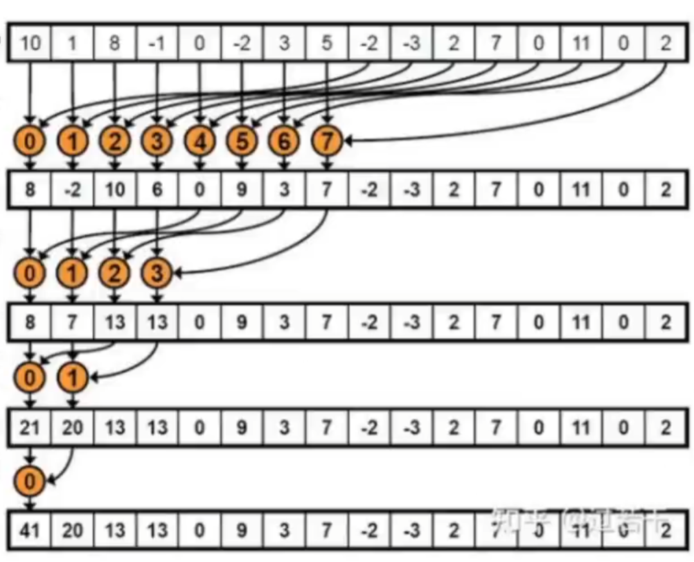
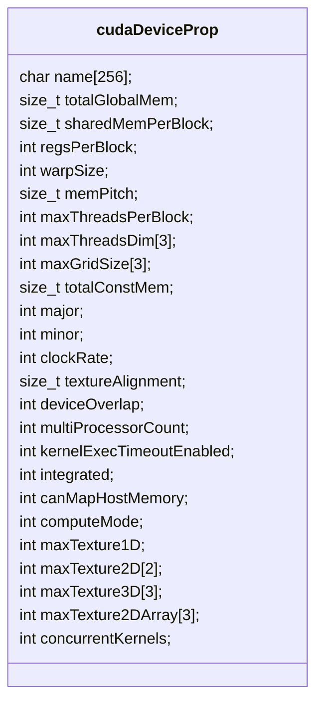
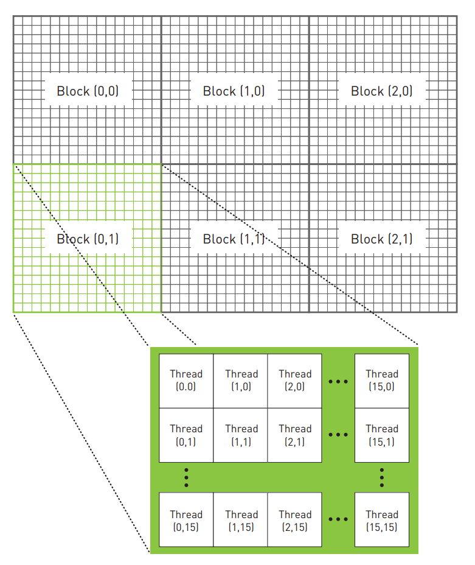
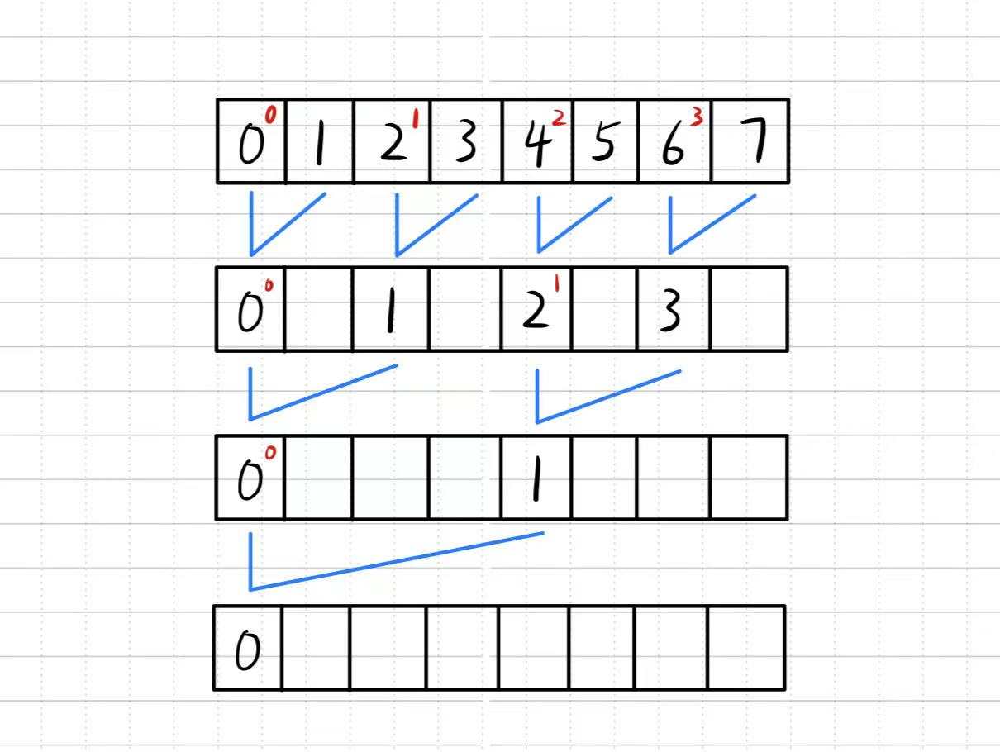
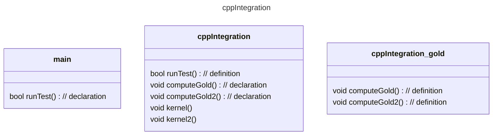
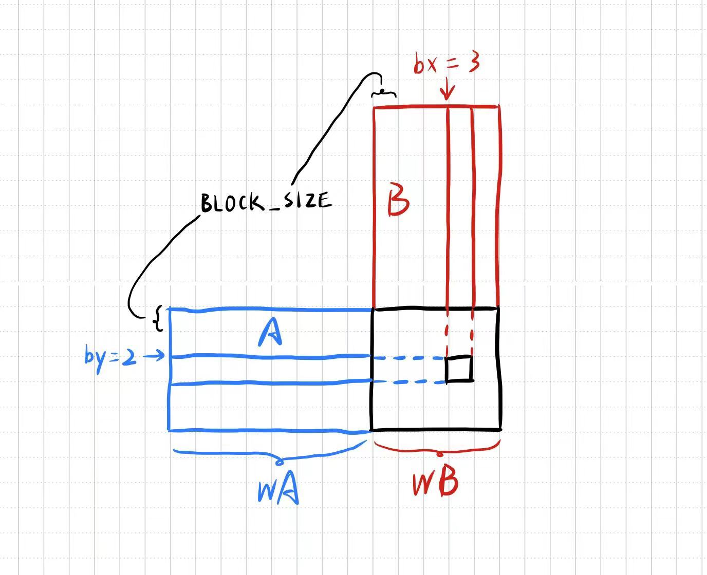
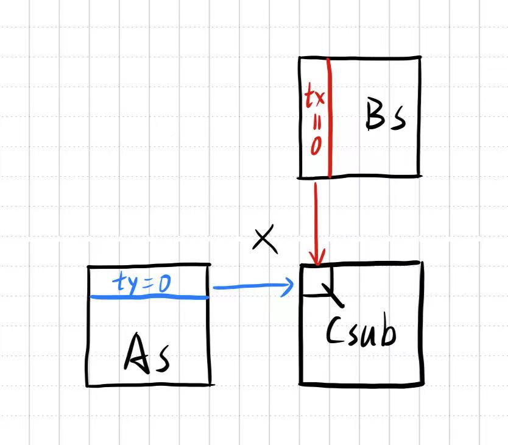

# 课程来源: [CUDA在现代C++中如何运用？](https://www.bilibili.com/video/BV16b4y1E74f/ "双笙子佯谬")(仅适合入门，正儿八经学老老实实看文档逛博客)

## 前置知识
* `__global__` 核函数，从CPU端通过三重尖括号调用，在GPU端上执行，不可以有返回值
* `__device__` 设备函数，在GPU上调用和执行，不需要尖括号，可以有返回值
* `host` 可以调用 `global`，`global` 可以调用 `device`，`device` 可以调用 `device`
* `cudaDeviceSynchronize()` 同步函数，令 `host` 等待 `device` 执行完
* `__inline__` 同C++的内敛函数声明
* `__host__` `__device__` 可以将函数同时定义在CPU和GPU上并调用，如下：
```C++
__host__ __device__ void say_hello() {
#ifdef __CUDA_ARCH__
    printf("GPU\n"); // 从GPU调用
#else
    printf("CPU\n"); // 从CPU调用
#endif
} // 一个函数可以通过__CUDA_ARCH宏在CPU和GPU上重载

__global__ void kernel() {
    say_hello();
}

int main() {
    kernel<<<1, 1>>>();
    cudaDeviceSynchronize();
    say_hello();
    return 0;
}
```
`__CUDA_ARCH__` 这个宏是本设备的版号，且只有**定义了(#ifdef)**才可以使用
```cmake
set(CMAKE_CUDA_ARCHITECTURES 52;61;75;86;89)
```
CMakeLists.txt 中需要加上自己设备的版号

---
## 板块
* 一个板块有多个线程，线程 < 板块 < 网格
* `blockDim` 板块中线程数量，`gridDim` 板块数量，`threadIdx` 线程在板块中的编号，`blockIdx` 板块编号
* <<<gridDim, blockDim>>>
* `checkCudaErrors(cudaFunc())` 可以检查错误，需要引入 `helper_cuda.h` 头文件
* `cudaMalloc(void **ptr, size_t n)` 在GPU上分配空间，CPU无法访问
`cudaMemcpy(void *dst, const void *src, size_t cnt, enum cudaMemcpyKind kind)` 在不同端之间拷贝数据，会自动同步
`cudaFree(void *ptr)` 释放GPU上的空间
* `cudaMallocManaged(void **ptr, size_t n)` 统一内存地址技术，CPU和GPU都能访问，需要同步

---
多个线程并行处理数组
```C++
__global__ void kernel(int *arr, int n) {
    int i = threadIdx.x;
    arr[i] = i;
}

int main() {
    int n = 32, *arr;
    checkCudaErrors(cudaMallocManaged(&arr, n * sizeof(int)));
    kernel<<<1, n>>>(arr, n);
    checkCudaErrors(cudaDeviceSynchronize());
    cudaFree(arr);
    ...
}
```

网格跨步循环
```C++
for (int i = threadIdx.x; i < n; i += blockDim.x) {
    ...
} // 例子：处理长度为8的数组，只分配4个线程，两轮就执行结束
```

---
## 从线程到板块
当需要处理的数据 `n` 远远大于硬件的线程数 `blockDim` 时，可以用 `n / blockDim` 作为 `gridDim`；但是当 `n` 不能整除 `blockDim` 时就会向下取整从而导致有余下的数据无法使用线程，有两种解决办法，一是**向上取整**，即 `gridDim = (n + blockDim - 1) / blockDim`，二还是**采用网格跨步循环**，如下：
```C++
for (int i = blockDim.x * blockIdx.x + threadIdx.x; i < n; i += gridDim.x * blockDim.x) {
    ...
} // 一次跨步为总的线程数量
```

---
## 在GPU上使用vector
vector的构造具有隐含的第二个模板参数，`std::vector<T, std::allocator<T>>`，vector会调用 `std::allocator<T>` 的 `allocate()`/`deallocate()` 函数，用以分配和释放内存。如果可以自定义一套基于GPU的allocator，那就可以在GPU上使用vector了，如下：
```C++
template <class T>
struct cudaAllocator {
    T *allocate(size_t size) {
        T *ptr = nullptr;
        checkCudaErrors(cudaMallocManaged(&ptr, size * sizeof(T)));
        return ptr;
    }
    void deallocate(T *ptr, size_t size = 0) {
        checkCudaErrors(cudaFree(ptr));
    }
    template <class ...Args>
    /**
    * @brief
    * vector在初始化时会对所有元素进行无参构造，但此过程是在CPU上进行的
    * 故在本例中要禁用，通过给allocator添加construct成员函数来改变vector的构造
    * 如果有参数且是传统类型(如int、char等)，则跳过其无参构造
    */
    void construct(T *p, Args &&...agrs) {
        if constexpr (!(sizeof...(Args) == 0 && std::is_pod_v<T>))
            ::new((void*)p) T(std::forward<Args>(args)...);
    }
}
```
使用 `constexpr` 关键字需在 CMakeLists.txt 中加上下面这句：
```cmake
target_compile_options(TARGET PUBLIC $<$<COMPILE_LANGUAGE:CUDA>:--expt-relaxed-constexpr>)
```

---
## 核函数也可以是模板函数
```C++
template <int N, class T>
__global__ void kernel(T *arr) {...}

kernel<n><<<32, 128>>>(arr.data());
// 调用时能自动通过arr的类型推出第二个模板参数类型
```
## 核函数也可以接受仿函数
```C++
template <class Func>
__global__ void parallel_for(int n, Func func) {
    for(int i = blockDim.x * blockIdx.x + threadIdx.x; i < n; i += blockDim.x * gridDim.x) {
        func(i);
    }
}

struct MyFunctor { // 仿函数：其对象可以被调用
    __device__ void operator()(int i) const {...}
}

int main() {
    int n = 65536;
    std::vector<int, cudaAllocator<int>> arr(n);

    parallel_for<<<32, 128>>>(n, MyFunctor{}); // 模板参数Func可由仿函数自动推导
    ...
}
```

也可以直接使用lambda，前提是在 CMakeLists.txt 文件中添加下面这句
```cmake
target_compile_options(TARGET PUBLIC $<$<COMPILE_LANGUAGE:CUDA>:--extended-lambda>)
```

```C++
parallel_for<<<32, 128>>>(n, [] __device__ (int i) {...});
```
但是有一点需要注意，如果在lambda中意欲使用 `[&]` 传引用捕获外部变量比如 `arr`，虽然其空间被分配在GPU上，但其本身的地址依旧在CPU的堆栈内，此时捕获的只能是 `arr` 变量本身

为了防止vector的深拷贝，可以使用 `[=]` 传值捕获：
```C++
int *arr_data = arr.data(); // data()返回一个起始地址，指针可以被浅拷贝
parallel_for<<<32, 128>>>(n, [=] __device__ (int i) { arr_data[i] = i; });
```

又或者可以更简便地在 `[]` 中写自由捕获表达式，使用同一变量名( `arr` 由外部的vector指针退化为lambda内部指向 `arr` 起始地址的指针)
```C++
parallel_for<<<32, 128>>>(n, [arr = arr.data()] __device__ (int i) { arr[i] = i; });
```

测试用例：x[i] = a * x[i] + y[i]
```C++
    int n = 1 << 25;
    float a = 3.14f;
    std::vector<float> x1(n), y1(n);
    std::vector<float, cudaAllocator<float>> x2(n), y2(n);

    for (int i = 0; i < n; i++) {
        x1[i] = std::rand() * (1.f / RAND_MAX);
        y1[i] = std::rand() * (1.f / RAND_MAX);
        x2[i] = std::rand() * (1.f / RAND_MAX);
        y2[i] = std::rand() * (1.f / RAND_MAX);
    }

    TICK(cpu);
    for (int i = 0; i < n; i++) {
        x1[i] = a * x1[i] + y1[i];
    }
    TOCK(cpu);

    TICK(gpu);
    parallel_for<<<n / 512, 128>>>(n, [a, x2 = x2.data(), y2 = y2.data()] __device__ (int i) {
        x2[i] = a * x2[i] + y2[i];
    });
    checkCudaErrors(cudaDeviceSynchronize());
    TOCK(gpu);
```

---
## thrust 库
* `universal_vector` 统一地址分配，`host_vector` 内存分配，`device_vector` 显存分配。可以通过 `=` 运算符在 `host_vector` 与 `device_vector` 之间拷贝数据
* `generate()` 用于在容器内批量生成一系列数字，例如：
```C++
thrust::generate(vector_host.begin(), vector_host.end(), [] {
    return std::rand() * (1.f / RAND_MAX)
});
```
* `for_each()` 可以批量修改容器内的数据，例如：
```C++
thrust::for_each(vector_device.begin(), vector_device.end(),
    [] __device__ (float &x) { x += 100.f; });

thrust::for_each(thrust::make_counting_iterator(0), thrust::make_counting_iterator(10),
    [] __device__ (int i) { std::cout << i << std::endl; }); // 相当于for区间
```
类似的还有很多标准库函数

---
## 原子操作
众所周知，被 `__global__` 修饰的核函数不能返回值，但可以用指针获取函数内求的结果，比如：
```C++
__global__ void parallel_sum(int *sum, const int *arr, int n) {
    for (int i = blockDim.x * blockIdx.x + threadIdx.x; i < n; i += blockDim.x * gridDim.x) {
        sum[0] += arr[i];
    }
}

int main() {
    int n = 65536;
    std::vector<int, cudaAllocator<int>> arr(n), sum(1);

    parallel_sum<<<n / 512, 128>>>(sum.data(), arr.data(), n);

    ...
}
```
但是，学过汇编的都知道，`sum[0] += arr[i]` 这个操作会被分为四步，分别是1. 取出 `sum[0]` 的值到寄存器A  2. 取出 `i` 以及 `arr[i]` 的值到寄存器B  3. 将 `sum[0]` 与 `arr[i]` 相加并存入寄存器B  4. 将值写回寄存器A。由于使用多线程运行，不可避免会出现取到旧值的情况，所以要为这个操作**上锁**，即使用原子操作：
* `atomicAdd(&sum[0], arr[i]);`

`aomicAdd()` 会返回旧值，相应的也会有其他的运算，如加减、异或与和最大最小值
但是这样也就让并行变为了串行，如果使用老版本cuda，这样做与在cpu中直接计算并无差距

* 解决办法之一：**TLS**(Thread Local Storage) （**同时也是平均效率最好的方法之一**，编译器会自动优化为BLS(Block Local Storage)）
```C++
__global__ void parallel_sum(int *sum, const int *arr, int n) {
    int local_sum = 0;
    for (int i = blockDim.x * blockIdx.x + threadIdx.x; i < n; i += blockDim.x * gridDim.x) {
        local_sum += arr[i];
    }
    atomicAdd(&sum[0], local_sum);
}

int main() {
    ...
    parallel_sum<<<n / 2056, 128>>>(sum.data(), arr.data(), n);
    ...
}
```
举个例子，n = 8192，那么此时的 `gridDim` 就是4，而 `blockDim` 则为128，即有4个板块，每个板块有128个线程，总共512个线程，**执行512次原子操作**，每个线程最多进行16次迭代即可退出循环（事实上也只有位于板块0的线程0才会完成最多的16次迭代）；而假如将原子操作放在循环体内，如 `atomicAdd(&sum[0], arr[i]);`，那么会完完整整执行8192次原子操作。使用TLS可以减少 `2056 / 128 = 16` 倍的原子操作数，也就意味着要尽可能地使 `blockDim * gridDim` 远小于 `n`

* 还有一种办法无需原子操作：
```C++
__global__ void parallel_sum(int *sum, const int *arr, int n) {
    for (int i = blockDim.x * blockIdx.x + threadIdx.x; i < n / 1024; i += blockDim.x * gridDim.x) {
        int local_sum = 0;
        for (int j = i * 1024; j < (i + 1) * 1024; j++) {
            local_sum += arr[j];
        } // 每个线程负责原数组中相邻1024个元素的求和
        sum[i] = local_sum;
    }
}

int main() {
    ...
    std::vector<int, cudaAllocator<int>> sum(n / 1024); // 开比n小1024倍的辅助数组
    ...
    parallel_sum<<<n / 1024 / 128, 128>>>(sum.data(), arr.data(), n); // 启动n / 1024个线程
    ...
    int final_sum = 0;
    for (int i = 0; i < n / 1024; i++) {
        final_sum += sum[i];
    }
    ...
}
```
核心思想就是使用一个比原数组小x倍的辅助数组，开共n/x个线程，每个线程串行处理x个数据，将结果储存到辅助数组中，最后cpu再串行地处理辅助数组即可（辅助数组的大小在接受范围内）

还有一种更高效的办法，就是采用类似希尔排序的思想并行处理数据，每一块分配线程数大小的辅助数组，第一次循环先将数据读入辅助数组，后面每一次都减半处理，如下图：

```C++
__global__ void parallel_sum(int *sum, const int *arr, int n) {
    for (int i = blockDim.x * blockIdx.x + threadIdx.x; i < n / 1024; i += blockDim.x * gridDim.x) {
        int local_sum[1024];
        for (int j = 0; j < 1024; j++) {
            local_sum[j] = arr[i * 1024 + j];
        }
        for (int j = 0; j < 512; j++) {
            local_sum[j] += local_sum[j + 512];
        } // 从这开始，每次都开始加上后一半的数据
        ...
        for (int j = 0; j < 1; j++) {
            local_sum[j] += local_sum[j + 1];
        }
        sum[i] = local_sum[0];
    }
}
```

---
## 板块共享内存
grid内的所有线程都是并行的（板块之间也是并行的），但每个板块都有一块自己的内存供板块内所有线程共享，可以使用 `__shared__` 进行声明定义
使用板块内存可以更好地提高并行度，但是要注意数据依赖，可以用 `__syncthreads()` 解决这个问题，它的功能是强制同步当前板块内的所有线程，即让所有线程运行到此行代码位置才可以继续进行
```C++
__global__ void parallel_sum(int *sum, const int *arr, int n) {
    __shared__ volatile int local_sum[1024]; // 板块共享内存，volatile关键字禁止编译器优化
    int i = blockIdx.x, j = threadIdx.x;

    local_sum[j] = arr[i * 1024 + j];
    __syncthreads();
    if (j < 512) {
        local_sum[j] += local_sum[j + 512];
    }
    __syncthreads();
    if (j < 256) {
        local_sum[j] += local_sum[j + 256];
    }
    ...
    if (j < 1) {
        sum[j] = local_sum[0] + local_sum[1];
    }
}
```
假设有一种情况，`threadIdx.x = 257` 的线程，执行第一个 `if` 块内的 `local_sum[257] += local_sum[769]`，那假如同时也有 `threadIdx.x = 1` 的线程，当它执行第二个 `if` 块内的 `local[1] += local_sum[257];` 时，由于线程之间的并发性和异步性，此时就会出现数据依赖错误，故**必须在每个if块前加上同步操作**，但是，又由于线程组（warp）32个线程为一组，SM对线程的调度是以组为单位的，所以最后 `j < 32` 以后就不需要同步了。但这又会引申出另一个问题——**线程组分支**
```C++
if (cond()) {
    A();
} else {
    B();
}
```
线程组中的32个线程不一定全都能进入相同的分支，如果这种情况发生，会导致两个分支都被执行，尽管在 `cond()` 为假的即本不该进入的分支会避免修改寄存器，但还是会产生额外的开销，因此建议在编程时，要尽可能使32个线程全处于一个分支中，否则消耗两倍时间。出于这种考虑，可以将上面 `j < 32` 以后的全合在一个 `if` 块里：
```C++
__syncthreads();
if (j < 32) {
    local_sum[j] += local_sum[j + 32];
    local_sum[j] += local_sum[j + 16];
    local_sum[j] += local_sum[j + 8];
    local_sum[j] += local_sum[j + 4];
    local_sum[j] += local_sum[j + 2];
    if (j < 1) {
        sum = local_sum[0] + local_sum[1];
    }
}
```

---
## 循环分块
矩阵转置例子：
```C++
template <typename T>
__global__ void parallel_transpose(T *out, const T *in, int _x, int _y) {
    int idx = blockDim.x * blockIdx.x + threadIdx.x;
    int x = idx % _x, y = idx / _x; // x:列序 y:行序
    if (x >= _x || y >= _y) return;
    out[x * _x + y] = in[idx]; // 转置
}

template <typename T>
void parallel_transpose_print(const T *arr, int x, int y) {
    for (int i = 0; i < y; i++) {
        for (int j = 0; j < x; j++) {
            std::cout << arr[i * y + j] << " ";
        }
        std::cout << std::endl;
    }
    std::cout << std::endl;
}

int main() {
    int x = 1 << 14, y = 1 << 14;
    std::vector<int, cudaAllocator<int>> in(x * y), out(x * y);
    ... // 预处理矩阵
    parallel_transpose_print(in.data(), x, y);

    parallel_transpose<<<x * y / 1024, 1024>>>(out.data(), in.data(), x, y); // 矩阵每个元素分配一个线程
    checkCudaErrors(cudaDeviceSynchronize());
    parallel_transpose_print(out.data(), y, x);
    ...
}
```
在转置过程中，对in的访问是传统的符合局部性原理的行主序访问，但对转置矩阵out的处理就是**列主序**了
使用二维的 `gridDim` 和 `blockDim` 可以实现GPU的循环分块，有利于提高缓存局部性：
```C++
template <typename T>
__global__ void parallel_transpose(T *out, const T *in, int _x, int _y) {
    int x = blockDim.x * blockIdx.x + threadIdx.x;
    int y = blockDim.y * blockIdx.y + threadIdx.y;
    if (x >= _x || y >= _y) return;
    out[x * _x + y] = in[y * _x + x];
}

int main() {
    ...
    parallel_transpose<<<dim3<x / 32, y / 32, 1>, dim3<32, 32, 1>>>>(out.data(), in.data(), x, y);
    ...
}
```

---
# CUDA by Example
## Chapter 3: Introduction to CUDA C
* 通过 `cudaDeviceProp` 这个类可以详细地了解当前设备的参数

用法：
```C++
cudaDeviceProp prop;
int cnt;
checkCudaErrors(cudaGetDeviceCount(&count)); // 一台主机上可能会有多个GPU
for (int i = 0; i < cnt; i++) {
    checkCudaErrors(cudaGetDeviceProperties(&prop, i));
    // do something with your device's properties
}
```

## Chapter 5: Parallel Programming in CUDA C
* 启动板块时需要注意向上取整，例如 N = 127 时，则 `kernel<<<N / 128, 128>>>();` 就会得出启动 0 个板块而错误，正确的做法应当是 `kernel<<<(N + 128 - 1) / 128, 128>>>()`
* 4060 的 `maxThreadsPerBlock` 为 1024，但最好不要用那么满，具体可以看[前面](#从线程到板块)

```C++
    int x = blockDim.x * blockIdx.x + threadIdx.x;
    int y = blockDim.y * blockIdx.y + threadIdx.y;
    int tid = y * blockDim.x * gridDim.x + x;
```
* `__shared__`分配的共享储存在每个板块上是独立的，仅供内部线程访问
* `__syncthreads()`会同步板块内所有线程，在控制块内需要慎用（会造成死锁）

## Chapter 6: Constant Memory and Events
* 板块内的线程是按 warp(32) 启动的，通过将常量声明为 `__constant__` 可以提高吞吐率，因为制约 GPU 处理速度的不太可能是算力，而是总线带宽，当一个线程读取 GPU 上的某一位置的常量，可以"广播"给 warp 内附近其它 15 个线程。通过 `cudaMemcpyToSymbol()` 可以将数据传输至 GPU。但是这样的代价就是 half-warp 的线程在短时间内只有一次读取常量内存的机会，而读取普通共享内存则有 16 次机会（但不具备上文提到的 cache）。如果读取不得不过于分散，还是用共享内存比较好
* GPU 上的 benchmark —— `cudaEvent_t`
```C++
cudaEvent_t start, end;
float elapsedTime;
cudaEventCreate(&start);
cudaEventCreate(&end);
cudaEventRecord(start);
kernel<<<x, y>>>();
cudaEventRecord(end);
cudaEventSynchronize(end);
cudaEventElapsedTime(&elapsedTime, start, end)
cudaEventDestroy(start)
cudaEventDestroy(end)
```
这本书由于内容过于远古，甚至第七章 texture 纹理内存的声明使用现今都不再支持，遂放弃阅读

# [cuda-samples](https://github.com/NVIDIA/cuda-samples)(强烈推荐[谭升的博客](https://face2ai.com/))
## 0_Introduction
### asyncAPI
`cudaMemcpyAsync` 是异步的，它会在传送数据完成前返回，下面是 benchmark 的异步例子
```C++
StopWatchInterface *timer = NULL;
sdkCreateTimer(&timer);
sdkResetTimer(&timer);

cudaEventRecord(start, 0);
sdkStartTimer(&timer);
cudaMemcpyAsync(device, host, size, cudaMemcpyHostToDevice);
kernel<<<x, y>>>(device); // 核函数也是异步的
cudaMemcpyAsync(host, device, size, cudaMemcpyDeviceToHost);
cudaEventRecord(end, 0);
sdkStopTimer(&timer); // CPU调用GPU结束

unsigned long int counter = 0;
while (cudaEventQuery(end) == cudaErrorNotReady) {
	counter++; // 以程序查询的方式等待GPU完成工作和数据传回
} checkCudaErrors(cudaEventElapsedTime(&gpu_time, start, end));
```

### clock
* 相邻配对 reduce 模板
```C++
void __global__ reduceNeighboredNaive(const T *input, T *output, float *timer) {
    extern __shared__ T shared[]; // shared[blockDim.x]

    if (threadIdx.x == 0) timer[blockIdx.x] = clock(); // additional record time of each block

    shared[threadIdx.x] = input[threadIdx.x], shared[threadIdx.x + blockDim.x] = input[threadIdx.x + blockDim.x]; // preprocess shared

    for (int stride = 1; stride < blockDim.x; stride <<= 1) {
        if (threadIdx.x % (stride * 2) == 0) { // this judge sentence cause half block of threads will be idle
            shared[threadIdx.x] += shared[threadIdx.x + stride];
        } __syncthreads();
    }

    if (threadIdx.x == 0) {
        output[blockIdx.x] = shared[0];
        timer[blockIdx.x + gridDim.x] = clock();
    }
}
```
`if (threadIdx.x % (stride * 2))` 会导致每前后一对线程只有一个满足条件执行控制块内语句，这样就导致每次以 stride 迭代处理 shared 都会只有一半地线程被闲置，这是非常低效的
* 改进：
```C++
void __global__ reduceNeighbor(const T *input, T *output) {
    ...
    for (int stride = 1; stride < blockDim.x; stride <<= 1) {
        int index = threadIdx.x * stride * 2;
        if (index < blockDim.x) {
            shared[index] += shared[index + stride];
        } __syncthreads();
    }
    ...
}
```

虽然无论在 naive 还是改进版中一开始都需要 8 个线程，但是改进后第一次只需要 4 个线程运行，余下的线程统一闲置，而不像 naive 中前一个线程在运行，后一个线程闲置

* 交错配对 reduce 模板
```C++
void __global reduceInterleavedNaive(const T *input, T *output) {
    ...
    for (int stride = blockDim.x / 2; stride > 0; stride >>= 1) {
        if (threadIdx.x < stride) {
            shared[threadIdx.x] += shared[threadIdx.x + stride];
        } __syncthreads();
    }
    ...
}
```
交错配对方式的 naive 情况下与上面相邻配对改进后的效果差不多，原因也类似

GPU 十分适合执行展开的循环操作，一个循环在CPU上的语言编译器可以很容易的被展开，但是CUDA的编译器并不能做到这点，所以展开操作需要人为编写
* 展开的归约
```C++
void __global__ reduceUnroll(const T *input, T *output, int n) {
    extern __shared__ T shared[];

    int offset = blockDim.x * blockIdx.x * 2 + threadIdx.x; // every 2 block per unit;
    if (offset + blockDim.x < n) { // combine 2 block to one block
        shared[threadIdx.x] = input[offset] + input[offset + blockDim.x];
    } else { // if gridDim is odd, deal the last block especially
        shared[threadIdx.x] = input[offset];
    } __syncthread();

    for (int stride = blockDim.x / 2; stride > 0; stride >>= 1) { // then reduce
        if (threadIdx.x < stride) {
            shared[threadIdx.x] += shared[threadIdx.x + stride];
        } __syncthreads();
    }

    if (threadIdx.x == 0) {
        output[blockIdx.x] = shared[0];
    }
}
```
上面这种优化方法是将两个块的数据提前整合到一个块内，理论上可以提高一般性能，还可以继续整合四个块、八个块等更大的

* 完全展开的归约
线程是按 warp 即32个为一组运行的，当上面的 stride 为32或更小时，就会出现一些启动的线程被搁置
```C++
void __global__ reduceUnrollCompleted(const T *input, T *output, int n) {
    extern __shared__ volatile T shared[]; // in case of compiler optimize array
    ...
    for (int stride = blockDim.x / 2; stride > 32; stride >>= 1) {
        ...
    } if (threadIdx.x < 32) { // shared[0] = sum of shared[0...63]
        shared[threadIdx.x] += shared[threadIdx.x + 32];
        shared[threadIdx.x] += shared[threadIdx.x + 16];
        shared[threadIdx.x] += shared[threadIdx.x + 8];
        shared[threadIdx.x] += shared[threadIdx.x + 4];
        shared[threadIdx.x] += shared[threadIdx.x + 2];
        shared[threadIdx.x] += shared[threadIdx.x + 1];
    }
}
/*
 *     threadIdx = 0            threadIdx = 16          threadIdx = 8
 * shared[0] += shared[32] shared[16] += shared[48] shared[8] += shared[40]
 * shared[0] += shared[16] shared[16] += shared[32] shared[8] += shared[24]
 * shared[0] += shared[8]  shared[16] += shared[24] shared[8] += shared[16]
 * shared[0] += shared[4]  shared[16] += shared[20] shared[8] += shared[12]
 * shared[0] += shared[2]  shared[16] += shared[18] shared[8] += shared[10]
 * shared[0] += shared[1]  shared[16] += shared[17] shared[8] += shared[9]
 * */
```
如上，理论上第16号线程不应当整合第32个位置的数据，但是，0号线程需要的只是整合过第48个位置数据的第16个数据，而且这32个线程的每一步都是同时进行的，所以在第16号线程将自己的数据变得无用之前，第0号线程就已经将它之前有用的数据读取，之后16号线程再怎么混乱都无所谓；同理第0号线程需要累加过第40号和第24号数据的第8号数据，并在第8号数据乱加之前就已将其正确的累加数据取出，关于这点可以结合之前小彭视频中的 `if (threadIdx.x < 32)` `if (threadIdx.x < 16)` `if (threadIdx.x < 8)` ...

### clock_nvrtc
提供一种方式使得C++可以与CUDA混合编程—— .cpp 可以使用 .cu 中实现的 kernel
```cmake
# CMakeLists.txt
target_link_libraries(main PRIVATE ${CUDA_PATH}/lib64/stubs/libnvrtc.so ${CUDA_PATH}/lib64/stubs/libcuda.so)
```
```C++
#include <nvrtc_helper.h>

int main(int argc, char **argv) {
    ...
    char *cubin, *kernel_file;
    size_t cubinSize;
    kernel_file = sdkFindFilePath("kernel_filename", argv[0]);
    compileFileToCUBIN(kernel_file, argc, argv, &cubin, &cubinSize, 0);

    CUmodule module = loadCUBIN(cubin, argc, argv);
    CUfunction kernel_addr;

    checkCudaErrors(cuModuleGetFunction(&kernel_addr, module, "timedReduction"));

    void *arr[] = {...}; // kernel arguments

    checkCudaErrors(cuLaunchKernel(kernel_addr,
        cudaGridSize.x, cudaGridSize.y, cudaGridSize.z, /* grid dim */
        cudaBlockSize.x, cudaBlockSize.y, cudaBlockSize.z, /* block dim */
        size, 0, /* shared mem, stream */
        &arr[0], /* arguments */
        0));
    ...
}
```

### concurrentKernels
**cuda stream**: cuda不仅可以通过硬件上的多线程完成内核级的并行，还可以通过流与事件实现网格级的并行。简单地说就是在主机端异步地执行启动kernel，kernel将自动运行在设备的multiprocessor上，流之间是异步的，流内按顺序执行，例如当kernel1在设备上完成计算时，kernel2正在从主机端向设备端传输数据


* 核函数调用的完整启动配置
```C++
kernel<<<dim3 gridDim, dim3 blockDim, size_t sharedMemSize = 0, cudaStream_t stream = 0>>>
```
之前使用的启动配置并没有显式地提供流的参数，cuda 会默认使用空流，其余涉及到流的函数也一样。空流是同步流，有些操作会阻塞主机操作。使用经过显式创建的流默认是异步阻塞流（也可以特别声明为非阻塞流），通常不会阻塞主机

* 数据传输的异步版本
一般的数据传输过程为：锁页-传输到内存上固定区域-传输到设备，使用 `cudaMallocHost` 可以直接在内存上分配到固定区域内存，提高传输效率
```C++
cudaError_t cudaMallocHost(void **ptr, size_t size); // 执行异步传输数据时，主机端的内存不能分页
cudaError_t cudaMemcpyAsync(void *dst, const void *src, size_t count, cudaMemcpyKind kind, cudaStream_t stream = 0);
```

* 流的创建
```C++
cudaStream_t stream; // declare
cudaError_t cudaStreamCreate(cudaStream_t *stream); // create
cudaError_t cudaStreamCreateWithFlags(cudaStream_t *stream, unsigned int flags); // cudaStreamDefault cudaStreamNonBlocking
cudaError_t cudaStreamDestroy(cudaStream_t stream); // destroy
```
回收操作虽然与设备上流的运行是异步的，但会保证只有当流运行结束时才会被回收

* 流的同步
```C++
cudaError_t cudaStreamSynchronize(cudaStream_t stream); // trap host until stream to be done
cudaError_t cudaStreamQuery(cudaStream_t stream); // return streamIsDone ? cudaSuccess : cudaErrorNotReady
cudaError_t cudaStreamWaitEvent(cudaStream_t stream, cudaEvent_t event); // stream wait until event to be done
```

* 流的优先级
```C++
cudaError_t cudaStreamCreateWithPriority(cudaStream_t *stream, unsigned int flags, int priority);
cudaError_t cudaDeviceGetStreamPriorityRange(int *leastPriority, int *greatestPriority);
```
不同的设备有不同的优先级，leastPriority 表示最低优先级（远离0），greatestPriority 表示最高优先级（接近0）

* 事件 event
event 的作用主要包括同步流和监控设备的进展，就像之前计算 elapsedTime 一样
```C++
cudaError_t cudaEventCreateWithFlags(cudaEvent_t* event, unsigned int flags);
// cudaEventDefault cudaEventBlockingSync cudaEventDisableTiming cudaEventInterprocess
```

* Hyper-Q 工作队列
```C++
int n_stream = 16;
for(int i=0;i<n_stream;i++) {
    kernel_1<<<grid,block,0,stream[i]>>>();
    kernel_2<<<grid,block,0,stream[i]>>>();
    kernel_3<<<grid,block,0,stream[i]>>>();
    kernel_4<<<grid,block,0,stream[i]>>>();
}
```
如上，**理想情况下设备会并发启动16个流**顺序执行4个 kernel，但在较老架构如 Fermi 上则不尽然，因为它只有1个工作队列。Kepler 支持的最大队列为32个，但在默认情况下被限制为8个，即一次启动8个流，分2次启动执行完，使用 setenv 可以修改这个限制。当然最终觉得设备能并发流数量的还是流内 kernel 对硬件资源的占用情况
```C++
setenv("CUDA_DEVICE_MAX_CONNECTIONS", "32", 1);
```

* 利用 event 创建流间依赖关系
如上所说，无论空流还是非空流，未特殊定义地话都是阻塞流，
```C++
int nkernels = 8, nstreams = nkernels + 1;
for (int i = 0; i < nkernels; i++) {
    kernel<<<block, thread, sharedSize, streams[i]>>>();
    cudaEventRecord(kernelEvent[i], streams[i]);
    // make the last stream wait for the kernel event to be done
    cudaStreamWaitEvent(streams[ntreams - 1], kernelEvent[i], 0);
}
```

* 流回调
```C++
cudaError_t cudaStreamAddCallback(cudaStream_t stream, cudaStreamCallback_t callback, void *userData, unsigned int flags);

void CUDART_CB func_callback(cudaStream_t stream, cudaError_t status, void *data) {
    ...
}

int main(int argc, char **argv) {
    cudaStreamAddCallback(stream, func_callback, (void*)data, 0);
}
```

### cppIntegration
这个 example 提供了一种将 CUDA 与已有应用或框架（如.cpp）结合的方法（非 `#include`），各个文件中函数的定义、实现和引用通过 `extern "C"` 关键字实现，如下图所示

main.cpp 中使用 cppIntegration.cu 中实现的 `runTest()`，前提是是先声明（需要用`extern "C"` 关键字修饰）一遍，同理 cppIntegration.cu 中要使用 cppIntegration_gold.cpp 实现的 `computeGold()` 与 `computeGold2()` 也需要先声明一次。而至于构建，直接按正常方式链接即可

### cppOverload
[源码](https://github.com/NVIDIA/cuda-samples/blob/master/Samples/0_Introduction/cppOverload/cppOverload.cu)
算是展示了下函数指针在cuda中的应用

### matrixMul
本案例展示了矩阵乘的一种实现
```C++
template <int BLOCK_SIZE>
__global__ void MatrixMulCUDA(float *C, float *A, float *B, int wA, int wB) {
  // wA: width of A  wB is the same way
  int bx = blockIdx.x;
  int by = blockIdx.y;

  int tx = threadIdx.x;
  int ty = threadIdx.y;

  int aBegin = wA * BLOCK_SIZE * by;
  int aEnd   = aBegin + wA - 1;
  int aStep  = BLOCK_SIZE;
  int bBegin = BLOCK_SIZE * bx;
  int bStep  = BLOCK_SIZE * wB;
  float Csub = 0;

  for (int a = aBegin, b = bBegin; a <= aEnd; a += aStep, b += bStep) {
    __shared__ float As[BLOCK_SIZE][BLOCK_SIZE];
    __shared__ float Bs[BLOCK_SIZE][BLOCK_SIZE];

    As[ty][tx] = A[a + wA * ty + tx];
    Bs[ty][tx] = B[b + wB * ty + tx];
    __syncthreads();

    #pragma unroll
    for (int k = 0; k < BLOCK_SIZE; ++k) {
      Csub += As[ty][k] * Bs[k][tx];
    } // tell the compiler to unroll the iteration
    __syncthreads();
  }
  int c = wB * BLOCK_SIZE * by + BLOCK_SIZE * bx;
  C[c + wB * ty + tx] = Csub;
}
dim3 threadsPerBlock(BLOCK_SIZE, BLOCK_SIZE);
dim3 blocksPerGrid(wA / threadsPerBlock.x, wB / threadsPerBlock.y);
MatrixMulCUDA<BLOCK_SIZE><<<threadsPerBlock, blocksPerGrid>>>(d_C, d_A, d_B, wA, wB);
```

结合图片来理解这个 kernel，首先 `aBegin`(A 矩阵每一行块的开端) & `bBegin`(B 矩阵每一列块的开端) 是由 `blockIdx` 来决定的，这说明是 kernel 中的每一 block 来处理两个矩阵的每一行和列；然后再看这个循环，迭代每次的增量 `step` 是行或列里的块距（这里其实就已经说明了cuda硬件上的 block 和本矩阵的块不是一个东西），一个 block 一次迭代处理行（列）块中的一个块（方格），然后通过 wA(hB) / BLOCK_SIZE 次迭代就处理完了一行（列）块
核心思想：通过迭代和在迭代内声明共享内存的方法让硬件上的 block 能够处理矩阵上的行（列）块
第一个 `__syncthreads()` 后，共享矩阵中 `BLOCK_SIZE * BLOCK_SIZE` 个线程已经准备好了 `BLOCK_SIZE * BLOCK_SIZE` 的矩阵数据，对应于行（列）块中的一块

最后再看计算 `Csub` 和写入 `C[]`，首先 `Csub` 是每个线程的本地变量，这里通过 `BLOCK_SIZE` 次内迭代实现矩阵乘法中的一行乘一列，得到一个暂时的 `Csub`，图中的只是 `tx = 0, ty = 0` 的 `Csub`；然后二维板块每个线程这样乘就得到了一个暂时的 `C[]` 数据，这样第二个 `__syncthreads()` 的作用就不言而喻了；最后外层还有一个迭代次数 `BLOCK_SIZE` 的大循环，每个 `Csub` 迭代累加就得到了最后的一个 `C[]` 数据
而 `C[]` 的保存位置是 `c`(块偏移) 和 block 内偏移（一个 block 内有 `BLOCK_SIZE * BLOCK_SIZE` 个 `Csub`）决定的，不再多讲。需要注意的是，在计算 `bStep` 和 最后的块内偏移是，乘的是 `wB` 而不是 `BLOCK_SIZE`

### matrixMulDrv
这个 [example](https://github.com/NVIDIA/cuda-samples/blob/master/Samples/0_Introduction/matrixMulDrv/matrixMulDrv.cpp) 呢就是又提供了一种其它工程使用CUDA的方式，就是先将 .cu 用编译器编译成 .fatbin 文件，之后在主工程内依靠 `#include <builtin_types.h`, `#include <helper_cuda_drvapi.h>` & `#include <cuda.h>` 使用，具体命令：
```bash
$ nvcc -I<CUDA_INCLUDES> -gencode arch=compute_<CUDA_ARCHITECTURE>,code=sm_<CUDA_ARCHITECTURE> -o <target>.fatbin -fatbin <source>
```

### simpleHyperQ
如果有 kernel 需要迭代处理，那么可以利用硬件的 Hyper-Q 技术实现并发
```C++
for (int i = 0; i < nstreams; ++i) {
  kernel_A<<<1, 1, 0, streams[i]>>>(&d_a[2 * i], time_clocks);
  total_clocks += time_clocks;
  kernel_B<<<1, 1, 0, streams[i]>>>(&d_a[2 * i + 1], time_clocks);
  total_clocks += time_clocks;
}
```
上面这个迭代会在硬件条件允许的范围内并发执行 `nstreams` 个流，每个流内的 kernel 严格按照顺序执行

### simpleCooperativeGroups
这个 example 展示了 cooperative_groups 的基本用法。cuda 虽然在块内提供了像 `__syncthread()` 这样的同步操作，但它是对板块内所有线程操作的，在一些实现更高性能的场合，这样显然是不够用的

首先按下面的方式可以获得 kernel 内线程块的句柄
```C++
cooperative_groups::thread_block group = cooperative_groups::this_thread_block();
```
与其它 cuda 程序一样，cooperative_groups 也有获取本线程信息的接口
```C++
int groupSize = group.size(); // blockDim
int index = group.thread_rank(); // threadIdx
group.sync(); // __syncthreads()
```
下面这个例子就实现了在一个板块内再划分数个16个线程一组的 tile，再分 tile 去处理
```C++
cooperative_groups::thread_block_tile<16> tiledPartition16 = cooperative_groups::tiled_partition<16>(group);
int sharedOffset = group.thread_rank() - tiledPartition16.thread_rank(); // extern __shared__ int shared[];
index = tiledPartition16.thread_rank(); // threadIdx in current tile
int res = func(tilePartition16, shared + sharedOffset, index); // __device__ int func(cooperative_groups::thread_group, int*, int);
```