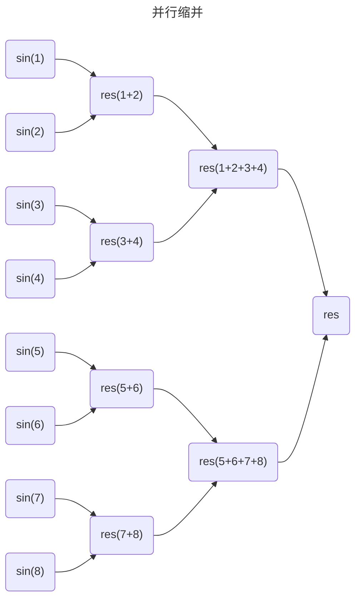
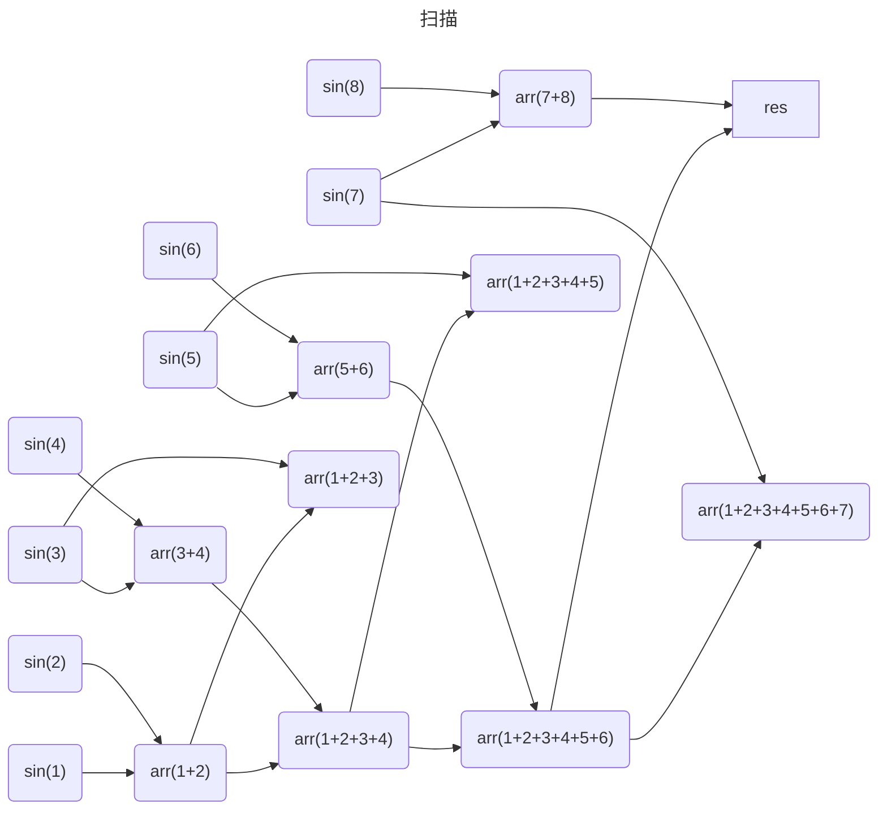

## [C++11开始的多线程编程](https://www.bilibili.com/video/BV1Ya411q7y4/ "双笙子佯谬")
## 0. std::chrono(C++11)
* 时间点: 2023年9月7日 `chrono::steady_clock::time_point` 等
* 时间段: 10秒 `chrono::milliseconds, chrono::seconds, chrono::minutes` 等
* 时间的相关计算符合现实标准
```C++
auto t0 = chrono::steady_clock_now(); // 获取当前时间点
auto t1 = t0 + chrono::seconds(30); // 当前时间点的30s后
auto dt = t1 - t0; // 时间差(30s时间段)
int sec = chrono::duration_cast<chrono::seconds>(dt).count(); // 时间段的秒数
```
* duration_cast 可以在任意的 duration 类型间转换，duration<T, R> 意思是用 T 类型表示单位为 R 的时间，例如：
```C++
using double_ms = std::chrono::duration<double, std::milli>;
double ms = std::chrono::duration_cast<double_ms>(dt).count();
// 将时间差用double的类型表示为毫秒数
```

---
## 1. 线程
#### std::thread(C++11)
使用需在 CMakeLists.txt 添加：
```cmake
find_package(Threads REQUIRED)
target_link_libraries(main PUBLIC Threads::Threads)
```
* std::this_thread::sleep_for
```C++
std::this_thread::sleep_for(std::chrono::milliseconds(400));
// 让当前线程睡眠400ms，chrono的强类型让单位选择更自由
```
* std::this_thread::sleep_until
```C++
auto t = std::chrono::steady_clock::now() + std::chrono::milliseconds(400);
std::this_thread::sleep_until(t);
// 让进程睡到某个时间点
```
* std::thread::hardware_concurrency
> 用来获取当前系统中可以同时运行多少个线程

---
传统的C++程序只是一个 main 函数的单线程，必须从头至尾挨个执行，效率低
* 使用 lambda 构造
```C++
std::thread t1([&] {
    download("hello.zip");
});
```
* 普通构造
```C++
std::thread t1{download, std::string("hello.zip")};
```

* 主线程等待子线程结束：`t1.join()`

在 return 之前添加可以让主线程等到 t1 结束再继续进行

---
* std::thread 的析构函数会销毁线程

作为一个C++类，thread 遵循 RAII(Resource Acquision Is Initialization) 思想和三五法则(拷贝构造、拷贝赋值、析构、移动构造、移动赋值)
t1 如果定义在其他函数中，如果该函数执行完，那么 t1 也就跟着被销毁了，这时如果继续使用 t1 就会出错

* 析构函数不再销毁线程：`t1.detach()`

但是 t1 并不会自动 `join()`，即主线程会不管被分离的 t1 是否执行完，解决方案：**全局线程池**
```C++
class threadPool {
public:
    void push_back(std::thread thr) {
        m_pool.push_back(std::move(thr));
    }
    ~threadPool() { // main函数结束前自动调用
        for (auto &t : m_pool) // 让线程池中的每一个线程都执行完再return
            if (t.joinable())
                t.join();
    }
private:
    std::vector<std::thread> m_pool;
}
```
下面这些因素会导致线程 `t.joinable() = false`：
* 由线程的缺省构造函数构造而成（无参构造）
* 线程被 `move()` 过
* 线程已被 `join()` 或 `detach()`

---
#### std::jthread(C++20)
jthread的析构函数会自动调用 `join()`，如果 `joinable()` 的话

---
## 2. 异步
`std::future` 代表一个异步操作的结果，它可以从一个异步任务中获取返回值
#### std::async
    include <future>
* `std::async` 是一个用于异步执行函数的模板，将程序的执行推到后台，接受一个带返回值的 lambda，自身返回一个 `std::future` 对象，并创建一个线程
```C++
int download(std::string file) {
    for (int i = 0; i < 10; i++) {
        std::cout << "Downloading " << file
                  << " (" << i * 10 << "%)..." << std::endl;
        std::this_thread::sleep_for(std::chrono::milliseconds(400));
    }
    std::cout << "Download complete: " << file << std::endl;
    return 404;
}

void interact() {
    std::string name;
    std::cin >> name;
    std::cout << "Hi, " << name << std::endl;
}

int main() {
    std::future<int> fret = std::async([&] {
        return download("hello.zip"); 
    }); // lambda的函数体将在另一个线程里执行，即download会在后台运行
    interact();
    int ret = fret.get(); // 如果此时download没完成，会等待download完成
    std::cout << "Download result: " << ret << std::endl;
    return 0;
}
```
* `get()` 会隐式地等待线程执行完毕即阻塞调用者线程，返回之前 `std::async` 构造时 lambda 的返回值
* `wait()` 可以显示地等待，只要线程没有执行完，会一直 wait 下去
* `wait_for()` 等待一段时间，返回一个 `std::future_status`
```C++
auto stat = fret.wait_for(std::chrono::milliseconds(1000));
if(stat == std::future_status::ready) { // 若在时间内执行完，则返回future_status::ready
    ...
} else { // 如果超过这个时间线程还没有执行完，则放弃等待，返回future_status::timeout
    ...
}
```
* 同理 `wait_until()` 的参数也是一个时间点
* `std::async` 的第一个参数可设为 `std::launch::deferred`，这时不会创建线程，只会把 lambda 函数体内的运算**推迟**到 `future` 的 `get()` 被调用时，所以这种写法不会涉及到多线程，可以实现惰性求值

---
#### 将任务与 future 关联：std::packaged_task
`std::packaged_task` 是一个可调用目标，它包装了一个任务，可以捕获其返回值，并将其储存到 `std::future` 对象中。一般的使用 `std::packaged_task` 步骤：
###### 1. 创建一个 `std::packaged_task` 对象，该对象包装了要执行的任务
###### 2. 调用 `std::packaged_task` 对象的 `get_future()` 函数，返回一个与任务关联的 `std::future` 对象
###### 3. 在需要任务结果的地方，调用与任务关联的 `std::future` 对象的 `get()` ，以获取任务的返回值

---
#### 手动创建线程：std::promise
用 `std::promise` 创建线程后，在线程返回时用 `set_value()` 设置返回值，再在主线程内用 `get_future()` 获取 `future` 对象，最后用 `get()` 获得返回值
```C++
std::promise<int> pret;
std::thread t1([&] {
    auto ret = download("hello.zip");
    pret.set_value(ret);
});
std::future<int> fret = pret.get_future();
interact();
int ret = fret.get();
```

---
## 3. 互斥量
#### std::mutex
```C++
std::vector<int> arr; // vector不是多线程安全容器
std::mutex mtx; // 互斥锁
std::thread t1([&] {
    for (int i = 0; i < 10; i++) {
        mtx.lock();
        arr.push_back(1);
        mtx.unlock();
    }
});
std::thread t2([&] {
    for (int i = 0; i < 10; i++) {
        mtx.lock();
        arr.push_back(2);
        mtx.unlock();
    }
})
```
* `lock()` 不仅会给线程上锁，还会检查是否已经上锁，如果已上锁，只有当别的线程 `unlock()` 后才会继续上锁，否则就会一直等下去
* `try_lock()` 成功上锁后会返回 `true`，如果已经上锁了则不会无限等待并返回 `false`
* `try_lock_for()` 可以等待一段时间，如果在时间段内成功上锁则返回 `true`，反之亦然，同样的还有 `try_lock_until`

---
#### std::lock_guard
`std::lock_guard` 为了防止程序员犯错写成死锁，将对 `std::mutex` 的 `lock()` 和 `unlock()` 操作进行封装，它的构造函数包含前者，析构函数包含后者，故退出作用域时能自动解锁
```C++
std::thread t1([&] {
    for (int i = 0; i < 10; i++) {
        std::lock_guard grd(mtx);
        arr.push_back(1);
    }
});
std::thread t2([&] {
    for (int i = 0; i < 10; i++) {
        std::lock_guard grd(mtx);
        arr.push_back(2);
    }
});
```

---
#### std::unique_lock：更高的自由度
`std::lock_guard` 严格在析构时 `unlock()`，但有时需要提前 `unlock()`
```C++
std::thread t1([&] {
    for (int i = 0; i < 10; i++) {
        std::unique_lock grd(mtx);
        arr.push_back(1);
    }
});
std::thread t2([&] {
    for (int i = 0; i < 10; i++) {
        std::unique_lock grd(mtx);
        arr.push_back(2);
        grd.unlock();
        // grd.lock(); // 甚至可以再次上锁
    }
});
```
`std::unique_lock` 储存了一个 flag 表示锁的状态，在析构时会检查，若还锁着，则 `unlock()`，即忘记解锁也没关系

#### 用 std::defer_lock 做参数
* `std::unique_lock` 还可以用 `std::defer_lock` 做参数
```C++
std::unique_lock grd(mtx, std::defer_lock);
```
构造函数不会自动 `lock()`，而必须手动调用

#### 用 std::try_to_lock 做参数
此时 `std::unique_lock` 的构造函数不会用 `lock()`，而是会用 `try_lock`

---
## 4. 死锁
```C++
std::thread t1([&] {
    for (int i = 0; i < 10; i++) {
        mtx1.lock(); // 1
        mtx2.lock(); // 3
        mtx2.unlock();
        mtx1.unlock();
    }
});
std::thread t2([&] {
    for (int i = 0; i < 10; i++) {
        mtx2.lock(); // 2
        mtx1.lock(); // 4
        mtx1.unlock();
        mtx2.unlock();
    }
});
```
当程序按如上的顺序执行，两个线程就会互相无限等待下去，即死锁

---
* 最简单的解决办法就是，一个**线程永远不要同时上多个锁**
* 也可以使线程们的上锁顺序一致
* 也可以使用 `std::lock()`，它保证了任意数量线程的调用顺序是否相同都不会死锁，如：
```C++
std::thread t1([&] {
    for (int i = 0; i < 10; i++) {
        std::lock(mtx1, mtx2);
        mtx1.unlock();
        mtx2.unlock();
    }
});
std::thread t2([&] {
    for (int i = 0; i < 10; i++) {
        std::lock(mtx2, mtx1);
        mtx2.unlock();
        mtx1.unlock();
    }
});
```
* `std::lock()` 的RAII版本 `std::scoped_lock()`，退出作用域后自动解锁

---
同一个线程重复调用 `lock()` 也会死锁
```C++
void other() {
    mtx1.lock();
    mtx1.unlock();
}
void func() {
    mtx1.lock();
    other();
    mtx1.unlock();
}
```
如上，当 func 调用 other 时也会造成死锁
* 最好不要在 other 里面上锁
* 或者可以改用 `std::mutex` 为 `std::recursive_mutex`

---
## 5. 数据结构
#### mutable
```C++
class MTVector {
public:
    void push_back(int val) {
        m_mtx.lock();
        m_arr.push_back(val);
        m_mtx.unlock();
    }
    size_t size() const {
        m_mtx.lock();
        size_t ret = m_arr.size();
        m_mtx.unlock();
        return ret;
    }
private:
    std::vector<int> m_arr;
    mutable std::mutex m_mtx;
}
```
`size()` 为 const 函数，不能改变类成员数据，但是 `m_mtx` 的上锁解锁会改变，这样会导致编译错误
* 解决方法就是声明 `m_mtx` 时前面加上 `mutable`

---
#### 读写锁：std::shared_mutex
* 读可以共享，写必须独占，且读与写不能同时进行
`push_back()` 会修改数据，对应读；`size()` 只读取数据，可以共享
```C++
size_t size() const {
    m_mtx.lock_shared();
    size_t ret = m_arr.size();
    m_mtx.unlock_shared();
    return ret;
}
```
* 正如 `std::unique_lock` 针对 `lock()`，`lock_shared()` 也有RAII的版本——**`std::shared_lock`** ，虽然很绕
```C++
void push_back(int val) {
    std::unique_lock grd(m_mtx);
    m_arr.push_back(val);
}
size_t size() const {
    std::shared_lock grd(m_mtx);
    return m_arr.size();
}
```

---
#### 访问者模式
暂时没看懂

---
## 6. 条件变量
#### 等待被唤醒：std::condition_variable
```C++
std::condition_variable cv;
std::mutex mtx;

std::thread t1([&] {
    std::unique_lock lck(mtx);
    cv.wait(lck); // 令t1陷入等待
    std::cout << "t1 is awake" << std::endl;
})

std::cout << "notifying..." << std::endl;
cv.notify_one(); // 主线程调用notify_one会唤醒t1
```
* `std::condition_variable` 仅支持 `std::unique_lock` 作为 `wait()` 的参数
* 还有 `wait_for()` 和 `wait_until()` 函数，分别接受 `std::chrono` 的时间段和时间点作为参数

```C++
std::condition_variable cv;
std::mutex mtx;
bool ready = false;

std::thread t1([&] {
    std::unique_lock lck(mtx);
    cv.wait(lck, [&] { return ready; }); // t1陷入
    std::cout << "t1 is awake" << std::endl;
});

std::cout << "notifying not ready" << std::endl;
cv.notify_one(); // expr为false，不唤醒

ready = true;
std::cout << "notifying ready" << std::endl; 
cv.notify_one(); // expr为true，唤醒
```
还可以额外指定一个参数变成 `cv.wait(lck, expr)`，其中 `expr` 是个 lambda ，只有当其返回值为 `true` 时才唤醒，否则 `notify_one()` 也没用
* `notify_one()` 只能唤醒一个线程，`notify_all()` 可以唤醒所有线程
```C++
    std::thread t1([&] {
        std::unique_lock lck(mtx); // unique_lock构造函数会自动上锁，若先t1线程先启动，则线程t2、t3都会卡在这一步
        cv.wait(lck); // 但是wait()会暂时unlock()
        std::cout << "t1 is awake" << std::endl;
    });
    std::thread t2([&] {
        std::unique_lock lck(mtx);
        cv.wait(lck);
        std::cout << "t2 is awake" << std::endl;
    });
    std::thread t3([&] {
        std::unique_lock lck(mtx);
        cv.wait(lck);
        std::cout << "t3 is awake" << std::endl;
    });
    std::this_thread::sleep_for(std::chrono::milliseconds(400));
    std::cout << "notifying one" << std::endl;
    cv.notify_one();

    std::this_thread::sleep_for(std::chrono::milliseconds(400));
    std::cout << "notifying all" << std::endl;
    cv.notify_all();
```
#### 生产者消费者问题
回忆操作系统那门课中的临界资源，只要访问它，都需要上锁和解锁
```C++
template <class T>
class MTQueue {
public:
    T pop() {
        std::unique_lock lck(m_mtx);
        m_cv.wait(lck, [this] { return !m_arr.empty(); });
        T ret = std::move(m_arr.back());
        m_arr.pop_back();
        return ret;
    }
    void push(T val) {
        std::unique_lock lck(m_mtx);
        m_arr.push_back(std::move(val));
        m_cv.notify_one();
    }
    void push_many(std::initializer_list<T> vals) {
        std::unique_lock lck(m_mtx);
        std::copy(std::move_iterator(vals.begin()), std::move_iterator(vals.end()),std::back_insert_iterator(m_arr));
        m_cv.notify_all(); // 当资源被分配完时剩下依旧阻塞的线程仍然会阻塞
    }
private:
    std::condition_variable m_cv;
    std::mutex m_mtx;
    std::vector<T> m_arr;
}
```

---
## 7. 原子操作
#### std::atomic
有时频繁的上锁解锁会使系统花费大量的开销在内核态的转换上，所以需要有一种开销小的办法完成对临界资源的访问修改
```C++
std::atomic<int> counter = 0;
// 无需上锁
std::thread t1([&] {
    for (int i = 0; i < 10; i++)
        counter += 1;
});
std::thread t2([&] {
    for (int i = 0; i < 10; i++)
        counter += 1;
});
```
只能使用 `+=` 或 `++` 这类运算符才能保证原子性，`counter = counter + 1;` 写法错误，无法保证原子性

    int old = atm.fetch_add(val);

`fetch_add()` 不仅会增加 `atm` 的值，还会返回增加前的值

    int old = counter.exchange(3);

`exchange(val)` 会把 `val` 写入 `counter` ，同时返回 `counter` 的旧值

    bool flag = counter.compare_exchange_strong(old, val);

判断 `counter` 与 `old` 是否相等，若不相等则将 `counter` 写入 `old` ，否则将 `val` 写入 `counter`

## [TBB开启的并行编程之旅](https://www.bilibili.com/video/BV1Ya411q7y4/ "双笙子佯谬")
```cmake
# CMakeLists.txt
find_package(TBB REQUIRED)
target_link_libraries(main PUBLIC TBB::tbb)
```
## 0. 任务组
#### task_group
`task_group` 可以启动多个任务，但一个任务不一定对应一个线程，若任务数量大于CPU最大线程数，tbb会在用户层进行调度
```C++
tbb::task_group tg;
tg.run([&] {
    download("hello.zip");
});
tg.run([&] {
    interact();
});
```
#### parallel_invoke
```C++
void parallel_invoke(Func &&...func)
```
```C++
std::string s = "Hello, world!";
tbb::parallel_invoke([&] {
    for (size_t i = 0; i < s.size() / 2; i++)
        if (s[i] == 'd')
            std::cout << "found!" << std::endl;
}, [&] { // 前后一半分别用一个线程查找
    for (size_t i = s.size() / 2; i < s.size(); i++)
        if (s[i] == 'd')
            std::cout << "found!" << std::endl;
});
```
---
## 1. 并行循环
#### parallel_for
* 一维 `blocked_range`
```C++
void parallel_for(const Range &range, const Func &func)
// 觉得麻烦也有更方便的重载
void parallel_for(size_t first, size_t last, const Func &func)
```
通过索引下标的方式访问
```C++
std::vector<float> a(n);
tbb::parallel_for(tbb::blocked_range<size_t>(0, n), [&] (tbb::blocked_range<size_t> r) {
    for (size_t i = r.begin(); i < r.end(); i++) {
        a[i] = std::sin(i);
    }
});
```
* 二维 `blocked_range2d`
```C++
blocked_range2d<typename RowValue, typename ColValue>(RowValue rowBegin, RowValue rowEnd, ColValue colBegin, ColValue colEnd)
```
```C++
tbb::parallel_for(tbb::blocked_range2d<size_t>(0, n, 0, n) [&] (tbb::blocked_range2d<size_t> r) {
    for (size_t i = r.rows.begin(); i < r.rows.end(); i++) {
        for (size_t j = r.cols.begin(); j < r.cols.end(); j++) {
            a[i * n + j] = std::sin(i) + std::sin(j);
        }
    }
});
```
* 三维及以上依此类推

#### 基于迭代器区间 parallel_for_each
```C++
void parallel_for_each(Iterator begin, Iterator end, const Func &func)
```
这种形式可以使用引用的方式访问修改容器数据
```C++
tbb::parallel_for_each(a.begin(), a.end(), [&] (float &f) {
    f = std::sin(i);
});
```
---
## 2. reduce & scan
#### parallel_reduce
```C++
Value parallel_reduce(const Range &range, const Value &identity, const Func &body, const Func &reduce)
```
```C++
float res = tbb::parallel_reduce(tbb::blocked_range<size_t>(0, n), std::static_cast<float>(0),
[&] (tbb::blocked_range<size_t> r, float local_res) {
    for (size_t i = r.begin(); i < r.end(); i++) {
        local_res += sin(i);
    }
    return local_res;
}, [] (float x, float y) {
    return x + y;
});
```
reduce 还有一个好处就是可以保持精度：当浮点数串行相加至非常大的值时，由于浮点数采用754标准，底数与指数分开存储，而相加又要牵扯到指数对齐，故当一个非常大的值与一个不怎么大的值相加，底数的精度就会丢失，但并行缩并就不存在这个问题

这样只需要 log(n) 的并行次数即可完成缩并
* `parallel_deterministic_reduce` 保证每次运行结果一致

#### parallel_scan
```C++
Value parallel_scan(const Range &range, const Value &identity, const Func &scan, const Func &reverseJoin)
```
```C++
float res = tbb::parallel_scan(tbb::blocked_range<size_t>(0, n), std::static_cast<float>(0)
[&] (tbb::blocked_range<size_t> r, float local_res, auto is_final) {
    for (size_t i = r.begin(); i < r.end(); i++) {
        local_res += std::sin(i);
        if (is_final) {
            a[i] = local_res;
        }
    }
    return local_res;
}, [] (float x, float y) {
    return x + y;
});
```
scan 除了利用 reduce 并行的计算总和， 还需要计算每一项的前 n 项和

---
## 3. benchmark
#### chrono
```C++
#include <chrono>
#define TICK(x) auto bench_##x = std::chrono::steady_clock::now();
#define TOCK(x) std::cout << #x ": " << std::chrono::duration_cast<std::chrono::duration<double>>(std::chrono::steady_clock::now() - bench_##x).count() << "s" << std::endl;
```

#### tick_count
```cmake
# CMakeLists.txt
find_package(TBB REQUIRED)
target_link_libraries(main PUBLIC TBB::tbb)
```
```C++
#include <tbb/tick_count.h>
#define TICK(x) auto bench_##x = tbb::tick_count::now();
#define TOCK(x) std::cout << #x ": " << (tbb::tick_count::now() - bench_##x).seconds() << "s" << std::endl;
```

#### Google Benchmark
```cmake
# CMakeLists.txt
find_package(benchmark REQUIRED)
target_link_libraries(main PUBLIC benchmark::benchmark)
```
```C++
#include <benchmark/benchmark.h>
void BM_for(benchmark::State &bm) {
    for (auto _ : bm) {
        func();
    }
}
BENCHMARK(BM_for);
BENCHMARK_MAIN();
```
利用 Google 提供的性能测试框架可以更精确地计算平均执行时间，只需将自己的测试函数放在 `for (auto _ : bm)` 即可，最后 `BENCHMARK_MAIN()` 会自动生成一个 main 函数，测试结果会打印在终端上，此外还接受一些命令行参数来控制测试的输出格式，具体的可以调用 `--help` 查看

## 4. 任务域与嵌套
#### task_arena
```C++
tbb::task_arena ta; // tbb::task_arena ta(4) 指定分配4个线程
ta.execute([&] {
    tbb.parallel_for((size_t)0, (size_t)n, [&] (size_t i) {
        a[i] = std::sin(i);
    });
});
```

#### 嵌套
* 嵌套死锁问题
```C++
tbb::parallel_for((size_t)0, (size_t)n, [&] (size_t i) {
    std::lock_guard grd(mtx);
    tbb::parallel_for((size_t)0, (size_t)n, [&] (size_t j) {
        a[i * n + j] = std::sin(i) * std::sin(j);
    });
});
```
tbb采用了工作窃取法来分配任务，即当一个线程 t1 完成自己队列的任务时，会从另一个线程 t2 的队列中取出任务执行，避免浪费资源，但这样也会导致内部 for 循环会窃取另一个外部 for 循环的任务，从而导致重复上锁，解决办法：
* 使用标准库的递归锁 `std::recursive_mutex`
```C++
std::recursive_mutex mtx;
std::lock_guard grd(mtx);
```
* 创建新的任务域
```C++
tbb::parallel_for((size_t)0, (size_t)n, [&] (size_t i) {
    std::lock_guard grd(mtx);
    tbb::task_arena ta;
    ta.execute([&] {
        tbb::parallel_for((size_t)0, (size_t)n, [&] (size_t j) {
            a[i * n + j] = std::sin(i) * std::sin(j);
        });
    });
});
```
* 使用 `isolate()` 隔离
```C++
tbb::parallel_for((size_t)0, (size_t)n, [&] (size_t i) {
    std::lock_guard grd(mtx);
    tbb::this_task_arena::isolate([&] {
        tbb::parallel_for((size_t)0, (size_t)n, [&] (size_t j) {
            a[i * n + j] = std::sin(i) * std::sin(j);
        });
    });
});
```

---
## 5. 任务分配
```C++
void parallel_for(const Range &range, const Func &func, const tbb::partitioner &partitioner)
```
`parallel_for` 还有第三个参数的重载，这个参数可以是不同类型的分区器
#### static_partitioner
不适用于循环体不均匀的情况
```C++
size_t n = 32;
tbb::task_arena ta(4);
ta.execute([&] {
    tbb::parallel_for(tbb::blocked_range<size_t>(0, n), [&] (tbb::blocked_range<size_t> r) {
        ...
    }, tbb::static_partitioner{});
});
```
此时会创建线程数量的任务数，每个线程处理一个任务，每个任务包括8个元素

还可以以指定粒度的方式，手动设置任务数
```C++
ta.execute([&] {
    tbb::parallel_for(tbb::blocked_range<size_t>(0, n, 16), [&] (tbb::blocked_range<size_t> r) {
        ...
    }, tbb::static_partitioner{});
});
```
这时会给2个线程创建2个任务，每个任务16个元素

#### simple_partitioner
不指定粒度时，会创建n个任务，即粒度为1。一般处理大数据时，最好手动指定粒度
```C++
ta.execute([&] {
    tbb::parallel_for(tbb::blocked_range<size_t>(0, n, 4), [&] (tbb::blocked_range<size_t> r) {
        ...
    }, tbb::simple_partitioner{});
});
```
此时会给4个线程创建8个任务，每个任务4个元素

#### auto_partitioner
自动分配

#### affinity_partitioner
记录历史，下次根据经验自动负载均衡

## 6. 并发容器
#### concurrent_vector
标准库的 vector 内元素地址是连续的，可以方便地按索引访问，但是当其 size 大于 capacity 时，vector 会重新分配一块更大的空间，将之前元素移动后再继续 push_back，这样就很低效
`concurrent_vector` 不保证内部元素地址连续，从而扩容时不需要移动，同时它的 push_back 会返回一个指向刚插入对象的迭代器，而代价就是失去随机访问的特点。此外它还是多线程安全的容器
* `grow_by` 一次性扩容一定大小

迭代器写法：
```C++
tbb::concurrent_vector<int> a(n);
tbb::parallel_for(tbb::blocked_range(a.begin(), a.end()), [&] (tbb::blocked_range<decltype(a.begin())> r) {
    ...
});
```

## 7. 并行筛选
* 并发容器版
```C++
// 筛选大于0的正弦值
parallel_for(tbb::blocked_range<size_t>(0, n), [&] (tbb::blocked_range<size_t> r) {
    std::vector<float> local_a;
    local_a.reserve(r.size()); // 预先分配空间
    for (size_t i = r.begin(); i < r.end(); i++) {
        float val = std::sinf(i);
        if (val > 0.f)
            local_a.push_back(val);
    }
    auto it = a.grow_by(local_a.size());
    std::copy(local_a.begin(), local_a.end(), it);
});
```
* 标准库容器版
```C++
std::mutex mtx;
a.reserve(n * 2 / 3);
parallel_for(tbb::blocked_range<size_t>(0, n), [&] (tbb::blocked_range<size_t> r) {
    std::vector<float> local_a;
    local_a.reserve(r.size());
    for (size_t i = r.begin(); i < r.end(); i++) {
        float val = std::sinf(i);
        if (val > 0.f)
            local_a.push_back(val);
    }
    std::lock_guard grd(mtx);
    std::copy(local_a.begin(), local_a.end(), std::back_inserter(a));
});
```

## 8. 分治 & 排序
* 斐波那契数列
```C++
int serial_fib(int n) {
    return n < 2 ? n : serial_fib(n - 1) + serial_fib(n - 2);
}

int fib(int n) {
    if (n < 20) // 太小的串行计算
        return serial_fib(n);
    int first, second;
    tbb::parallel_invoke([&] {
        first = fib(n - 1);
    }, [&] {
        second = fib(n - 2);
    });
    return first + second;
}
```

* 快速排序
```C++
template <class T>
void quick_sort(T *data, size_t size) {
    if (size < 1)
        return;
    if (size < (1 << 6)) {
        std::sort(data, data + size, std::less<T>{});
        return;
    }
    size_t mid = std::hash<size_t>{}(size);
    mid ^= std::hash<void*>{}(static_cast<void*>(data));
    mid %= size;
    std::swap(data[0], data[mid]);
    T pivot = data[0];
    size_t left = 0, right = size - 1;
    while (left < right) {
        while (left < right && !(data[right] < pivot))
            right--;
        if (left < right)
            data[left++] = data[right];
        while (left < right && data[left] < pivot)
            left++;
        if (left < right)
            data[right--] = data[left];
    }
    data[left] = pivot;
    tbb::parallel_invoke([&] {
        quick_sort(data, left);
    }, [&] {
        quick_sort(data + left + 1, size - left - 1);
    });
}
```
实际运用中直接使用 tbb 已封装好的 `parallel_sort` 即可

---
## 9. 流水线并行
当多个线程各自在处理大量的数据时，由于三级缓存大小的限制，导致缓存被频繁换入换出失去局部性，于是有必要使用流水线并行对其优化
```C++
std::vector<Data> dats(n);
std::vector<float> res(n);
auto it = dats.begin();

tbb::parallel_pipline(8,
    tbb::make_filter<void, Data*>(tbb::filter_mode::serial_in_order, [&] (tbb::flow_control &fc) -> Data* {
        if (it == dats.end()) {
            fc.stop();
            return nullptr;
        }
        return &*it++;
    }), tbb::make_filter<Data*, Data*>(tbb::filter_mode::parallel, [&] (Data *dat) -> Data* { // 无数据依赖，可以并行
        dat->step1();
        return dat;
    }), tbb::make_filter<Data*, Data*>(tbb::filter_mode::parallel, [&] (Data *dat) -> Data* {
        dat->step2();
        return dat;
    }), tbb::make_filter<Data*, Data*>(tbb::filter_mode::parallel, [&] (Data *dat) -> Data* {
        dat->step3();
        return dat;
    }), tbb::make_filter<Data*, float>(tbb::filter_mode::parallel, [&] (Data *dat) -> float) {
        return std::reduce(dat.begin(), dat.end());
    }), tbb::make_filter<float, void>(tbb::filter_mode::serial_out_of_order, [&] (float sum) -> void {
        res.push_back(sum);
    })
);
```
* `serial_in_order` 表示当前任务只允许串行执行，且执行顺序一致；`serial_out_of_order` 表示可以打乱顺序；`parallel` 则表示任务可以并行
* 每一个 `filter` 的输入、输出类型都可以不一样，但条件是必须与上下对齐
* 流水线内部也可以使用 `parallel_for` 进一步并行