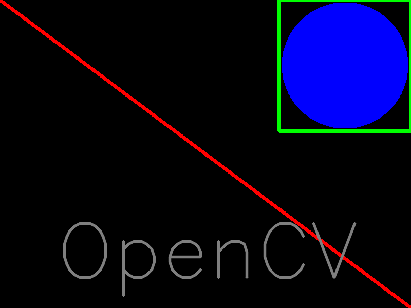
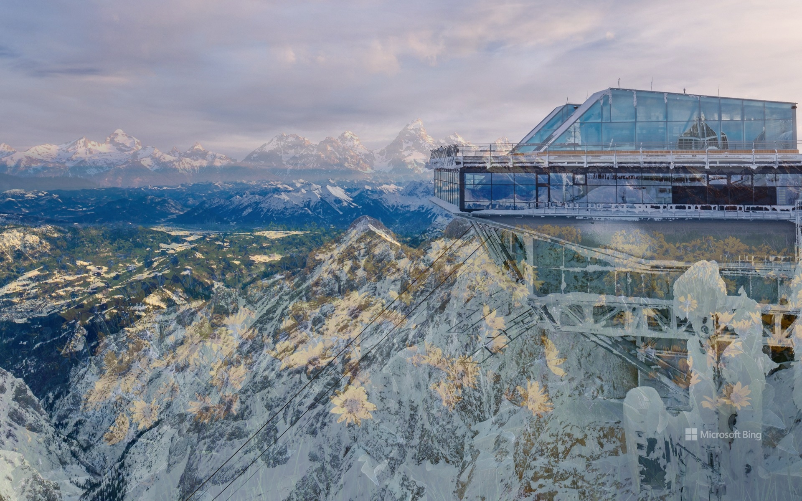

## 来源：[黑马程序员OpenCV开源教程](https://www.bilibili.com/video/BV1Fo4y1d7JL/) ##
# 1. 基本操作 #
## 图像操作 ##
#### 1.1 图像读取 ####
    cv2.imread(filename: str, flag: int = ...) -> MatLike
参数：
* 图像文件的路径
* 标志（读取的方式）
    * 1(`cv2.IMREAD*COLOR`) RGB模式（默认参数）
    * 0(`cv2.IMREAD*GRAYSCALE`) 灰度模式
    * -1(`cv2.IMREAD_UNCHANGED`) RGBA模式

#### 1.2 图像显示 ####
    cv2.imshow(winname: str, mat: MatLike) -> void
参数：
* 窗口名称
* 已读取的图像对象

#### 1.3 保存图像 ####
    cv2.imwrite(filename: str, img: MatLike, params: Sequence[int] = ...) -> bool
参数：
* 文件路径
* 需要保存的文件对象

#### 1.4 与键盘交互 ####
    cv2.waitKey(delay: int = ...) -> int
参数：
* 默认为0，意为按下任意键后停止等待；当为大于0的整数数，意为等待相应的毫秒数；返回按键的ASCII码值

Tips:
* 一般情况下，无参数或参数为0为显示图像的理想选择，而参数为1则用于显示视频

#### 1.5 关闭窗口 ####
    cv2.destroyWindow(winname: str) -> void
参数：
* 窗口名
---
    cv2.destroyAllWindows() -> void
无参数

---
#### example ####
```py
import cv2 as cv
img = cv.imread("./image.png")
cv.imshow("window", img)
while(1):
    key = cv2.waitKey()
    if key == 0x1B: # ESC
        break
cv2.destroyAllWindows()
```

## 绘制图形 ##
#### 1.6 直线 ####
    cv2.line(img: MatLike, pt1: Point, pt2: Point, color: Scalar, thickness: int = ...) -> MatLike
参数：
* 图像对象
* 直线的起点和终点
* 线条颜色
* 线条宽度

#### 1.7 圆环 ####
    cv2.circle(img: MatLike, center: Point, radius: int, color: Scalar, thickness: int = ...) -> MatLike
参数：
* **当线条宽度为-1时，圆为实心圆**

#### 1.8 矩形 ####
    cv2.rectangle(img: MatLike, pt1: Point, pt2: Point, color: Scalar, thickness: int = ...) -> MatLike
参数：
* 矩形左上角和右下角

#### 1.9 添加文本 ####
    cv2.putText(img: MatLike, text: str, org: Point, fontFace: int, fontScale: float, color: Scalar, thickness: int = ...) -> MatLike
参数：
* 文本放置位置
* 字体和字体大小

---
#### example ####
```py
import cv2 as cv
import numpy as np

img = np.zeros((600, 800, 3), np.uint8)

cv.line(img, (0, 0), (799, 599), (0, 0, 0xFF), 5) # opencv中颜色格式为BGR
cv.rectangle(img, (543, 0), (799, 255), (0, 0xFF, 0), 5)
cv.circle(img, (671, 127), 123, (0xFF, 0, 0), -1)
cv.putText(img, "OpenCV", (110, 540), cv.FONT_HERSHEY_SIMPLEX, 5, (0x7F, 0x7F, 0x7F), 4, cv.LINE_AA)
cv.imwrite("./image/OpenCV.png", img)

cv.imshow("image", img)
cv.waitKey()
cv.destroyAllWindows()
```


#### 1.10 获取并修改图像像素点 ####
```py
img = cv2.imread("./image.png")
pixel_value = img[100, 100] # 获取图像位于(100, 100)像素点的BGR值
img[100, 100] = [0xFF, 0xFF, 0xFF] # 修改该像素点的值
```

#### 1.11 获取图像属性 ####
|属性|API|
|---|---|
|行数、列数和通道数|img.shape|
|像素总个数|img.size|
|数据类型|img.dtype|

#### 1.12 通道的拆分与合并 ####
拆分：

    cv2.split(m: MatLike) -> Sequence[MatLike]
合并：

    cv2.merge(mv: Sequence[MatLike]) -> MatLike


#### 1.13 改变色彩空间 ####
    cv2.cvtColor(src: MatLike, flag: int) -> MatLike
参数：
* flag：转换类型
    * cv2.COLOR_BGR2GRAY
    * cv2.COLOR_BZGR2HSV

---
#### example ####
```py
import cv2 as cv
img = cv.imread("./image/OpenCV.png")
b, g, r = cv.split(img)
cv.imshow("blue", b)
cv.imshow("green", g)
cv.imshow("red", r)

img2 = cv.merge((b, g, r))
cv.imshow("merge", img2)

img3 = cv.cvtColor(img2, cv.COLOR_BGR2GRAY)
cv.imshow("gray", img3)

cv.waitKey()
cv.destroyAllWindows()
```

## 算术操作 ##
#### 1.14 图像加法 ####
    cv2.add(src1: MatLike, src2: MatLike) -> MatLike
OpenCV的`add()`操作是**饱和**加法，即像素值最大可以加至`255`，忽略多余部分；而普通的`+`运算符操作会执行模运算
```py
>>> img = np.uint8([250, 100, 200])
>>> img2 = np.uint8([50, 180, 20])
>>> img3 = cv.add(img, img2)
>>> img4 = img + img2
>>> print(img3)
[[255]
 [255]
 [220]]
>>> print(img4)
[ 44  24 220]
```

#### 1.15 图像混合 ####
    cv2.addWeighted(src1: MatLike, alpha: float, src2: MatLike, beta: float, gamma: float)
参数：
* 前四个参数分别是两张图像的对象和权重
* 第五个参数为修正量gamma，目前入门学习阶段设为0即可

---
example
```py
import cv2 as cv

img = cv.imread("./image/Balsamroot wildflowers bloom below the Teton Mountains in Grand Teton National Park, Wyoming.jpg")
img2 = cv.imread("./image/Cable car station at the summit of Zugspitze mountain in Grainau, Garmisch-Partenkirchen, Germany.jpg")

img3 = cv.addWeighted(img, 0.3, img2, 0.7, 0)
cv.imwrite("./image/addWeighted.jpg", img3)

cv.imshow("addWeighted", img3)
cv.waitKey()
cv.destroyAllWindows()
```



